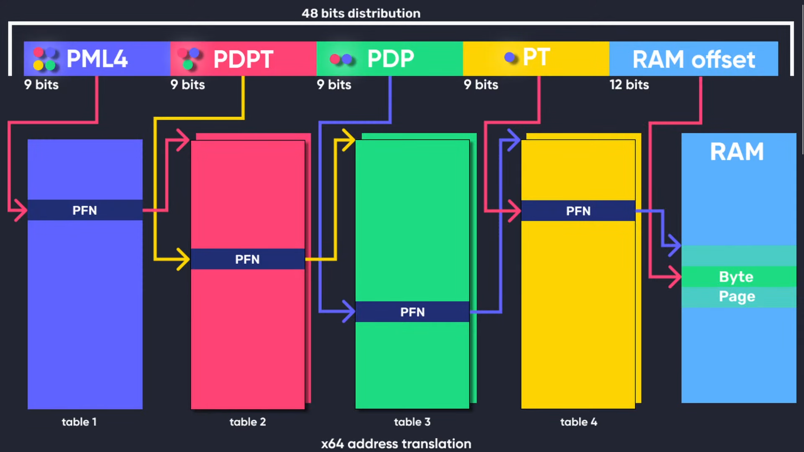
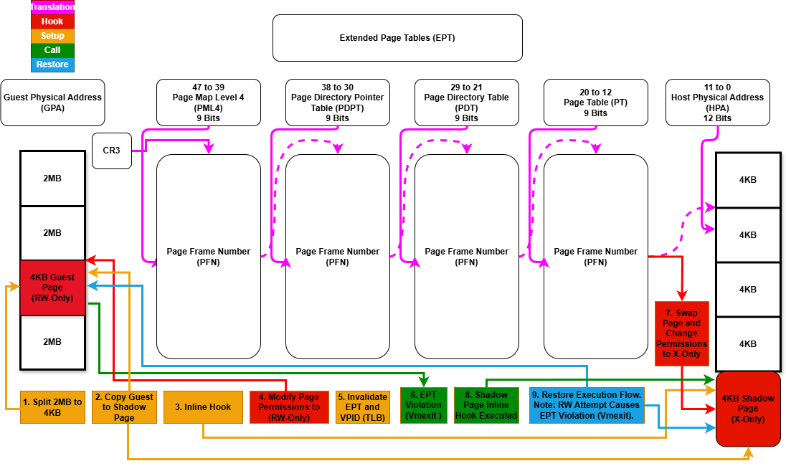
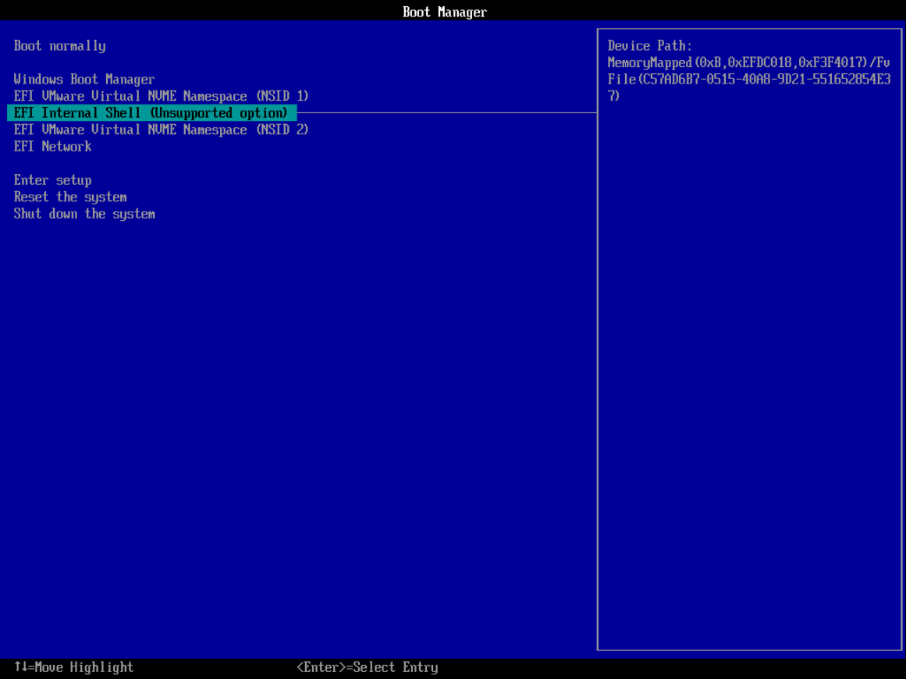
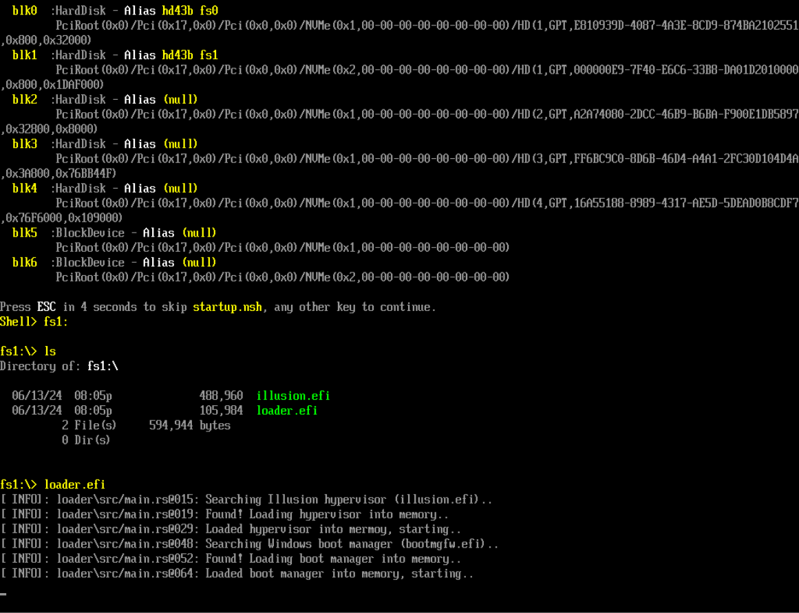
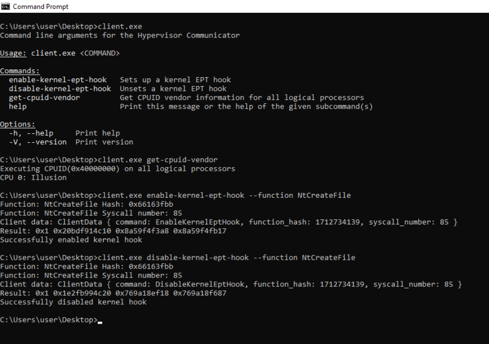

# Windows UEFI Blue Pill Type-1 Hypervisor in Rust (Codename: Illusion)


A lightweight, memory-safe, and blazingly fast Rust-based type-1 research hypervisor with hooks for Intel VT-x, focused on studying the core concepts of virtualization.

**Note:** The [**Illusion** hypervisor](https://github.com/memN0ps/illusion-rs) (Windows UEFI Blue Pill Type-1 Hypervisor in Rust) is more stable, supports more features, and is overall better designed. The [**Matrix** hypervisor](https://github.com/memN0ps/matrix-rs) (Windows Kernel Blue Pill Type-2 Hypervisor in Rust) is an older, experimental version and is not intended for production use. Both projects serve as templates to help people get started with hypervisor development in Rust.

## Description

**Paging: Translating x64 Virtual Addresses to Physical Addresses**

This diagram illustrates the mechanism of translating x64 virtual addresses to physical addresses in traditional paging systems. In x64 architecture, this translation involves four levels of page tables: PML4, PDPT, PDT, and PT (Page Map Level 4, Page Directory Pointer Table, Page Directory Table, and Page Table). Each level uses 9 bits of the virtual address to index into the next level, ultimately pointing to a specific physical address in RAM. This process is managed by the operating system and the Memory Management Unit (MMU), which translates virtual addresses used by software into physical addresses used by hardware.

  
**Figure 1: [x64 Virtual Address Translation](https://www.youtube.com/watch?v=W3o5jYHMh8s) (Full Credits: [Guided Hacking](https://guidedhacking.com/threads/x64-virtual-address-translation.20416/))**

**Extended Page Tables (EPT): Second Level Address Translation (SLAT)**

Extended Page Tables (EPT) are a feature of hardware-assisted virtualization technologies such as Intel VT-x and AMD-V's Nested Page Tables (NPT). EPT implements Second Level Address Translation (SLAT), specifically designed for virtualized environments. While traditional paging translates virtual addresses to physical addresses within the guest OS, EPT adds an additional layer by translating guest physical addresses (used by the guest OS) to host physical addresses (used by the hypervisor). This second layer of translation is managed by the hypervisor, allowing guest operating systems to manage their own page tables independently. SLAT improves performance by minimizing the need for VM exits during memory operations, which reduces overhead and enhances virtualization efficiency.

The diagram below demonstrates how to implement hidden EPT hooks in the Windows UEFI Blue Pill Type-1 Hypervisor (Codename: Illusion) written in Rust.

  
**Figure 2: Extended Page Tables (EPT) Hooks (Illusion)**

## Features

### PatchGuard Compatible Features

- :white_check_mark: Hidden System Call (Syscall) Hooks Via System Service Descriptor Table (SSDT).
- :white_check_mark: Hidden Kernel Inline Hooks.
- :white_check_mark: Hidden Model Specific Registers (MSR) Hooks.

### Processor-Specific Features

- :white_check_mark: Extended Page Tables (EPT).
- :white_check_mark: Memory Type Range Registers (MTRRs).
- :x: Intel Processor Trace (PT).

### Microsoft Hyper-V Compatible Features

- :x: Support for running as a nested hypervisor under Microsoft Hyper-V (Type-2) with Virtualization Based Security (VBS) Enabled.
- :x: Support for running as the primary hypervisor on top of Microsoft Hyper-V (Type-1) with Virtualization Based Security (VBS) Enabled.

### VM Exit Handling

- :white_check_mark: VM Exit Handling: `ExceptionOrNmi (#GP, #PF, #BP, #UD)` (0), `InitSignal` (3), `StartupIpi` (4), `Cpuid` (10), `Getsec` (11), `Hlt` (12), `Invd` (13), `Vmcall` (18), `Vmclear` (19), `Vmlaunch` (20), `Vmptrld` (21), `Vmptrst` (22), `Vmresume` (24), `Vmxon` (27), `Vmxoff` (26), `ControlRegisterAccesses` (28), `Rdmsr` (31), `Wrmsr` (32), `MonitorTrapFlag` (37), `Rdtsc` (49), `EptViolation` (48), `EptMisconfiguration` (50), `Invept` (53), `Invvpid` (55), `Xsetbv` (55).

### Hypervisor Detection

- :white_check_mark: Hide hypervisor memory from guest using EPT (redirect guest memory that points to host memory to a dummy page filled with 0xFFs).
- :white_check_mark: Custom Page Table-based hypervisor detection bypass (provides isolation and security from guest, including CR3 trashing).
- :white_check_mark: Custom GDT and IDT-based hypervisor detection bypass (ensures isolation and security from guest).
- :white_check_mark: CPUID-based hypervisor detection bypass (unset HypervisorPresent and remove vendor ID signature for Feature Information and Hypervisor Vendor).
- :white_check_mark: MSR-based hypervisor detection bypass (inject #GP for invalid, unsupported, and reserved Hyper-V MSR vmexits).
- :white_check_mark: CR-based hypervisor detection bypass (shadow CR0 and CR4 to hide hypervisor-specific bits).
- :white_check_mark: XSETBV-based hypervisor detection bypass (inject #GP for invalid or unsupported XSETBV vmexits).
- :white_check_mark: VMCALL-based hypervisor detection bypass (inject #GP for invalid or unsupported VMCALL vmexits).
- :white_check_mark: ExceptionOrNMI-based hypervisor detection bypass (inject #GP, #PF, #BP, #UD for specific exception vmexits).
- :white_check_mark: Unconditional vmexits (inject #UD for unconditional vmexits, but for Vmxon, inject #UD if it does not contain VMXE; otherwise, inject #GP if it contains VMXE).
- :x: EPT-based hypervisor detection bypass (write check, timing check, and thread check).
- :x: RDTSC-based hypervisor detection bypass.
- :white_check_mark: Remove hypervisor memory from the UEFI memory map/table (identify the memory regions occupied by the hypervisor and modifies the UEFI memory map to mark those regions as `UNUSABLE`).

### Isolation and Security

- :white_check_mark: Custom implementations of the Global Descriptor Table (GDT), Interrupt Descriptor Table (IDT), and Page Tables to enhance the security and isolation of the hypervisor.

## Supported Hardware

- :white_check_mark: Intel processors with VT-x and Extended Page Tables (EPT) support.
- :x: AMD processors with AMD-V (SVM) and Nested Page Tables (NPT) support.

## Supported Platforms

- :white_check_mark: Windows 10 - Windows 11, x64 only.

## Installation

- Install Rust from [here](https://www.rust-lang.org/tools/install).
- Install cargo-make: `cargo install cargo-make`.

## Building the Project

- Debug: `cargo make build-debug`.
- Release: `cargo make build-release`.

## Running the Project

- Debug: `cargo make run-debug`.
- Release: `cargo make run-release`.

## Debugging

- Serial Port Logging: Use a serial port logger to capture logs from the hypervisor.

#### Enabling Debug Modes

- Test Mode: Activate test signing with `bcdedit.exe /set testsigning on`.
- Windows Debugging: Follow the steps in this [Microsoft guide](https://learn.microsoft.com/en-us/windows-hardware/drivers/devtest/bcdedit--bootdebug).

```powershell
bcdedit.exe /bootdebug {bootmgr} on
bcdedit.exe /bootdebug on
bcdedit.exe /debug on
```

#### Network Debugging with Windbg

- Setup: `bcdedit.exe /dbgsettings net hostip:w.x.y.z port:n`.

## Usage

A UEFI blue-pill hypervisor operates under the following conditions:

- **Secure Boot is Disabled**: No vulnerabilities needed (**supported by this project**).
- **Virtualization-Based Security (VBS) is Disabled**: Ensures compatibility.
- **Exploiting Known UEFI Flaws**: Using outdated or unsupported firmware, including the Bring Your Own Vulnerable Binary (BYOVB) technique, to bypass Secure Boot.
- **Exploiting Unspecified UEFI Flaws**: Using zero-day vulnerabilities to disable Secure Boot.

### Configuration Note

When setting up this UEFI hypervisor, it's important to configure the file depending on the number of logical processors/cores/threads based on your system. Please edit the relevant code in [global_const.rs](https://github.com/memN0ps/illusion-rs/blob/main/hypervisor/src/global_const.rs). 

The global heap allocator is shared among all processors/cores/threads and is a pre-allocated pool of memory. The stack size is allocated per processor/core/thread. This design makes it easier to keep track of memory allocations, especially for tasks like setting up hooks that require pre-allocated buffers. By adjusting the settings in this file, you ensure that enough memory is allocated to accommodate all processors while maintaining optimal performance and resource management.


## Usage 1: Running a UEFI Blue-Pill Hypervisor through the UEFI Shell on VMware Workstation (Supported)

0. **Create a Virtual USB Drive for Booting**

   Run the following PowerShell script as an administrator to create a new partition on the USB drive and format it as FAT32. This script shrinks the existing partition by 512 MB and creates a new partition with the label "Hypervisor" on the USB drive. Make sure to modify the drive letters according to your environment. Alternatively, you can use a physical USB drive.

    ```powershell
    # Define the size to shrink in MB
    $sizeToShrinkMB = 512
    
    # Define the drive letter of the existing partition to shrink
    $existingDriveLetter = "C"
    
    # Define the drive letter and label for the new partition
    $newDriveLetter = "D"
    $newFileSystemLabel = "Hypervisor"
    
    # Shrink the existing partition
    $volume = Get-Volume -DriveLetter $existingDriveLetter
    $partition = $volume | Get-Partition
    Resize-Partition -DriveLetter $partition.DriveLetter -Size ($partition.Size - ($sizeToShrinkMB * 1MB))
    
    # Create a new partition in the unallocated space
    $disk = Get-Disk -Number $partition.DiskNumber
    $newPartition = New-Partition -DiskNumber $disk.Number -UseMaximumSize -DriveLetter $newDriveLetter
    
    # Format the new partition
    Format-Volume -DriveLetter $newDriveLetter -FileSystem FAT32 -NewFileSystemLabel $newFileSystemLabel
    
    Write-Output "Partition created and formatted successfully."
    ```


1. **Setup for VMware Workstation**

   - **Build the Project**: Follow the build instructions provided in the previous sections to compile the project.

2. **Set Up VMware Workstation**

   Configure VMware Workstation to boot into the firmware setup on the next boot and to use the physical USB drive as the boot device:

   - **Add a Hard Disk:**
     - Physical USB: Go to `VM -> Settings -> Hardware -> Add -> Hard Disk -> Next -> SCSI or NVMe (Recommended) -> Next -> Use a physical disk (for advanced users) -> Next -> Device: PhysicalDrive1 and Usage: Use entire disk -> Next -> Finish.`
     - Virtual USB: Go to `VM -> Settings -> Hardware -> Add -> Hard Disk -> Next -> SCSI or NVMe (Recommended) -> Next -> Use a physical disk (for advanced users) -> Next -> Device: PhysicalDrive0 and Usage: Use individual partitions -> Select Partition -> Next -> Finish.`
   - **Add a Serial Port:**
     - Go to `VM -> Settings -> Add -> Serial Port -> Finish`.
     - Select `Use output file: C:\Users\memN0ps\Documents\GitHub\illusion-rs\logs.txt` to direct the Serial Port output from COM1 to the `logs.txt` file. (You can choose any location, but the preference is within the project directory).
   - **Boot Options:**
     - If you're not using the automated PowerShell script, start the VM by clicking `Power On to Firmware`.
     - Select `Internal Shell (Unsupported option)` or `EFI VMware Virtual SCSI Hard Drive (1.0)`.

3. **Run the PowerShell Script**

   Execute the following PowerShell script to automate the setup process. Make sure to modify the paths according to your environment.

   ```powershell
   ### Change paths according to your environment ###

   # Set build type to either 'debug' or 'release'
   $buildType = "debug" # Use this line for a debug build
   # $buildType = "release" # Uncomment this line and comment the above for a release build

   # Define the file path to copy all EFI files based on the build type
   $efiFilePaths = ".\target\x86_64-unknown-uefi\$buildType\*.efi"

   # Define the destination path on the USB drive D:\
   $usbFilePath = "D:\"

   # Define the path to the VMX file
   $vmxPath = "C:\Users\memN0ps\Documents\Virtual Machines\Class_Windows\Class_Windows.vmx"

   # Define the path to the vmrun.exe file
   $vmrunPath = "C:\Program Files (x86)\VMware\VMware Workstation\vmrun.exe"

   # Define the path to the log file
   $logFilePath = ".\logs.txt"

   # Copy all EFI applications to the D:\ drive
   Copy-Item -Path $efiFilePaths -Destination $usbFilePath

   # Print the contents of the D:\ drive to verify the copy operation
   Get-ChildItem -Path D:\ -Recurse

   # Append configuration to the VMX file for booting into firmware setup on next boot
   Add-Content -Path $vmxPath -Value "bios.forceSetupOnce = `"TRUE`""

   # Check if the log file exists and delete it if it does
   if (Test-Path $logFilePath) {
       Remove-Item $logFilePath -Force
       Write-Host "Log file $logFilePath deleted."
   }

   # Start the VMware VM and open the GUI. Attempt to boot to firmware (if supported).
   & "$vmrunPath" -T ws start "$vmxPath" gui

   # Wait for the log file to be created (e.g., by another process) before proceeding to tail it
   while (-not (Test-Path $logFilePath)) {
       Start-Sleep -Seconds 1
       Write-Host "Waiting for log file to be created..."
   }

   # Tail the log file to display live updates from the start
   Write-Host "Monitoring log file from the start for updates..."
   Get-Content -Path $logFilePath -Wait
   ```


**Figure 3: VMware Workstation Boot Options**

4. **Navigate to the USB Drive and Start the Hypervisor**

   In the UEFI Shell, navigate to the USB drive and run the loader (`loader.efi`). The hypervisor will start, followed by the Windows Boot Manager (`bootmgfw.efi`) to boot into Windows.


**Figure 4: VMware Workstation UEFI Shell**

5. **Interact with the Hypervisor**

   After Windows boots, use `client.exe` to interact with the hypervisor and perform various operations, including checking the hypervisor's presence or setting hidden EPT hooks.


**Figure 5: Hypervisor Client**

### PoC

Verify the execution of the EPT hooking proof of concept (PoC) by checking the hypervisor's logs (serial port logger through COM ports) and Windbg. A PoC screenshot is provided below.


**Figure 6: Logs and Windbg PoC**

## Usage 2: Running a UEFI Blue-Pill Hypervisor through the UEFI Shell on Baremetal (Supported)

The following outlines a supported method to execute a UEFI blue-pill hypervisor using the UEFI Shell. By leveraging either the EDK2 EFI shell or the UEFI-Shell, users can set up a USB drive to boot into a UEFI shell environment. From there, the hypervisor can be loaded and executed directly.

1. **Build the Project**

   Follow the build instructions provided in the previous sections to compile the project.

2. **Download EDK2 EFI Shell or UEFI-Shell**

   - [EDK2 EFI Shell](https://github.com/tianocore/edk2/releases)
   - [UEFI-Shell](https://github.com/pbatard/UEFI-Shell/releases)

3. **Prepare the USB Drive**

   a. Extract the downloaded EFI shell and rename the file `Shell.efi` (found in the `UefiShell/X64` folder) to `bootx64.efi`.
   
   b. Format the USB drive to FAT32.
   
   c. Create the following folder structure on the USB drive:
   ```
   USB:.
   │   loader.efi
   │   illusion.efi
   │
   └───EFI
       └───Boot
              bootx64.efi
   ```

## Usage 3: Infecting the Windows Boot Manager (bootmgfw.efi) on Disk (Unsupported)

UEFI blue-pill hypervisors can target the Windows Boot Manager (`bootmgfw.efi`) found in the EFI partition at `\EFI\Microsoft\Boot\bootmgfw.efi` (also at `C:\Windows\Boot\EFI\bootmgfw.efi`). The process involves:

1. Convert the hypervisor into position-independent code (PIC) or shellcode.
2. Locate `bootmgfw.efi` in the EFI partition.
3. Add a new `.efi` section to `bootmgfw.efi`.
4. Inject the hypervisor shellcode into the new `.efi` section.
5. Modify the entry point to point to the shellcode.
6. Reboot the system.

More information: [Bootkitting Windows Sandbox](https://secret.club/2022/08/29/bootkitting-windows-sandbox.html)

## Acknowledgments, References, and Motivation

Big thanks to the amazing people and resources that have shaped this project. A special shout-out to everyone listed below. While I didn't use all these resources in my work, they've been goldmines of information, super helpful for anyone diving into hypervisor development, including me.

- **[Daax (@daaximus)](https://github.com/daaximus)**: For his outstanding free series on hypervisor development, which is one of the best resources available and has greatly influenced my work with its thorough research and clear explanations. His support and answers to my questions were invaluable in getting me started with hypervisor development:
    - [7 Days to Virtualization](https://revers.engineering/7-days-to-virtualization-a-series-on-hypervisor-development/).
    - [MMU Virtualization via Intel EPT](https://revers.engineering/mmu-virtualization-via-intel-ept-index/).

- **[Satoshi Tanda (@tandasat)](https://github.com/tandasat)**: Satoshi Tanda's guidance, projects, and structured training programs have been incredibly helpful. His detailed explanations and contributions on GitHub have significantly enhanced my understanding, making him a great mentor throughout my journey:
    - [Hypervisor Development for Security Researchers](https://tandasat.github.io/Hypervisor_Development_for_Security_Researchers.html).
    - [Hypervisor 101 in Rust](https://github.com/tandasat/Hypervisor-101-in-Rust).
    - Additional Projects: [Hello-VT-rp](https://github.com/tandasat/Hello-VT-rp), [DdiMon](https://github.com/tandasat/DdiMon), [HyperPlatform](https://github.com/tandasat/HyperPlatform), [MiniVisorPkg](https://github.com/tandasat/MiniVisorPkg).

- **[Sina Karvandi (@Intel80x86)](https://github.com/SinaKarvandi)**: For his detailed free Hypervisor From Scratch series:
    - [Tutorial Series](https://rayanfam.com/tutorials/).
    - [GitHub Repository](https://github.com/SinaKarvandi/Hypervisor-From-Scratch/).

- **[Jess (@jessiep_)](https://github.com/Intege-rs)**: For his invaluable support and collaboration in several areas of this project, providing essential insights and expertise, and for his quick responses to my questions.

- **[Feli (@vmctx)](https://github.com/vmctx/)**: For their invaluable support and collaboration in several areas of this project, providing essential insights and expertise, and for his quick responses to my questions.

- **[Wcscpy (@Azvanzed)](https://github.com/Azvanzed/)**: For his invaluable support and collaboration in several areas of this project, providing essential insights and expertise, and for his quick responses to my questions.

- **[Drew (@drew)](https://github.com/drew-gpf)**: For his invaluable support and collaboration in several areas of this project, providing essential insights and expertise, and for his quick responses to my questions.

- **[Matthias (@not-matthias)](https://github.com/not-matthias)**: For his impactful work on the [amd_hypervisor](https://github.com/not-matthias/amd_hypervisor) project, which greatly inspired and influenced this research.

- **[Nick Peterson (@everdox)](https://github.com/everdox)** and **[Aidan Khoury (@ajkhoury)](https://github.com/ajkhoury)**: For their insightful explorations into hypervisor introspection and syscall hooking:
    - [Patchguard: Hypervisor Based Introspection [P1]](https://revers.engineering/patchguard-detection-of-hypervisor-based-instrospection-p1/).
    - [Patchguard: Hypervisor Based Introspection [P2]](https://revers.engineering/patchguard-detection-of-hypervisor-based-instrospection-p2/).
    - [Syscall Hooking Via Extended Feature Enable Register (EFER)](https://revers.engineering/syscall-hooking-via-extended-feature-enable-register-efer/).

#### Community and Technical Resources

- **[Secret Club](https://github.com/thesecretclub)**: Insights into anti-cheat systems and hypervisor detection, which also inspired this project:
    - [System emulation detection](https://secret.club/2020/04/13/how-anti-cheats-detect-system-emulation.html) by [@Daax](https://github.com/daaximus), [@iPower](https://github.com/iPower), [@ajkhoury](https://github.com/ajkhoury), [@drew](https://github.com/drew-gpf).
    - [BattlEye hypervisor detection](https://secret.club/2020/01/12/battleye-hypervisor-detection.html) by [@vmcall](https://github.com/vmcall), [@Daax](https://github.com/daaximus).

- **Other Essential Resources**:
    - [Intel's Software Developer's Manual](https://www.intel.com/).
    - [Maurice Heumann's (@momo5502)](https://github.com/momo5502/) [Detecting Hypervisor-Assisted Hooking](https://momo5502.com/posts/2022-05-02-detecting-hypervisor-assisted-hooking/).
    - [Guided Hacking's](https://guidedhacking.com/) [x64 Virtual Address Translation](https://www.youtube.com/watch?v=W3o5jYHMh8s) on YouTube.
    - [UnKnoWnCheaTs](https://unknowncheats.me/) [forum post](https://www.unknowncheats.me/forum/2779560-post4.html) by [@namazso](https://github.com/namazso).
    - [RVM1.5](https://github.com/rcore-os/RVM1.5), [Barbervisor](https://github.com/Cisco-Talos/Barbervisor), [rustyvisor](https://github.com/iankronquist/rustyvisor), [orange_slice](https://github.com/gamozolabs/orange_slice), [mythril](https://github.com/mythril-hypervisor/mythril), [uhyve](https://github.com/hermit-os/uhyve), [maystorm](https://github.com/neri/maystorm).
    - [AMD-V Hypervisor Development by Back Engineering](https://blog.back.engineering/04/08/2022), [bluepill by @_xeroxz](https://git.back.engineering/_xeroxz/bluepill).
    - [hvpp by @wbenny](https://github.com/wbenny/hvpp).
    - [HyperHide by @Air14](https://github.com/Air14/HyperHide).
    - [How AetherVisor works under the hood by M3ll0wN1ght](https://mellownight.github.io/AetherVisor).
    - [Rust library to use x86 (amd64) specific functionality and registers (x86 crate for Rust)](https://github.com/gz/rust-x86).
    - [DarthTon's HyperBone](https://github.com/DarthTon/HyperBone) (based on the legendary [Alex Ionescu's](https://github.com/ionescu007/SimpleVisor) version) on [UnknownCheats](https://www.unknowncheats.me/forum/c-and-c-/173560-hyperbone-windows-hypervisor.html).
    - [Joanna Rutkowska: Pioneering the Blue Pill Hypervisor Concept, one of the earliest proofs of concept](https://blog.invisiblethings.org/2006/06/22/introducing-blue-pill.html).

#### Helpers and Collaborators

Special thanks to:
- [Daax](https://revers.engineering/).
- [Satoshi Tanda (@tandasat)](https://github.com/tandasat).
- [Drew (@drew)](https://github.com/drew-gpf).
- [iPower (@iPower)](https://github.com/iPower).
- [Namazso (@namazso)](https://github.com/namazso).
- [Jess (@jessiep_)](https://github.com/Intege-rs).
- [Matthias @not-matthias](https://github.com/not-matthias/).
- [@felix-rs / @joshuа](https://github.com/felix-rs).
- [Wcscpy (@Azvanzed)](https://github.com/Azvanzed/).
- [Ryan McCrystal / @rmccrystal](https://github.com/rmccrystal).
- [Jim Colerick (@vmprotect)](https://github.com/thug-shaker).
- [Xitan (@xitan)](https://github.com/x1tan).

## License

This project is licensed under the MIT License. For more information, see the [MIT License details](./LICENSE).